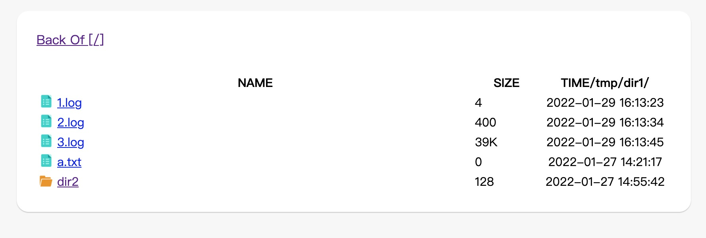

#### LANGUAGE
[English](https://github.com/wanggaolin/go-fileHttp#readme)
[中文](https://github.com/wanggaolin/go-fileHttp/blob/master/doc/readme_zh.md)

#### Describe
Lightweight file sharing system



#### Install
##### [for linux]
```shell
git clone https://github.com/wanggaolin/go-fileHttp.git && cd go-fileHttp && ./file_http
```
##### [for mac]
```shell
wget https://github.com/wanggaolin/go-fileHttp/archive/refs/tags/mac-v1.0.tar.gz
tar -xvf mac-v1.0.tar.gz
cd go-fileHttp-mac-v1.0   
./file_http
```


#### default config 
| Key               | Value              |Describe              |
|  ----------       | :-----------:      |   :-----------:      |                    
| ROOT_DIR          | $HOME              |   User home directory           |
| ERROR_LOG         | error.log          |   error log                |
| ERROR_LOG         | access.log         |   access log               |
| LISTEN            | 0.0.0.0:9191       |   listen addres             |


### required parameter
| Header               | Value                           |Describe              |
|  ----------       | :-----------:                     |   :-----------:      |                    
| Content-Type      | application/json <br> application/text <br> application/html               |   Defining return types          |


#### use/example
##### example1:
```shell
curl -H "Content-Type:application/json" http://127.0.0.1:9090/
curl -H "Content-Type:application/text" http://127.0.0.1:9090/
curl -H "Content-Type:application/html" http://127.0.0.1:9090/
```
